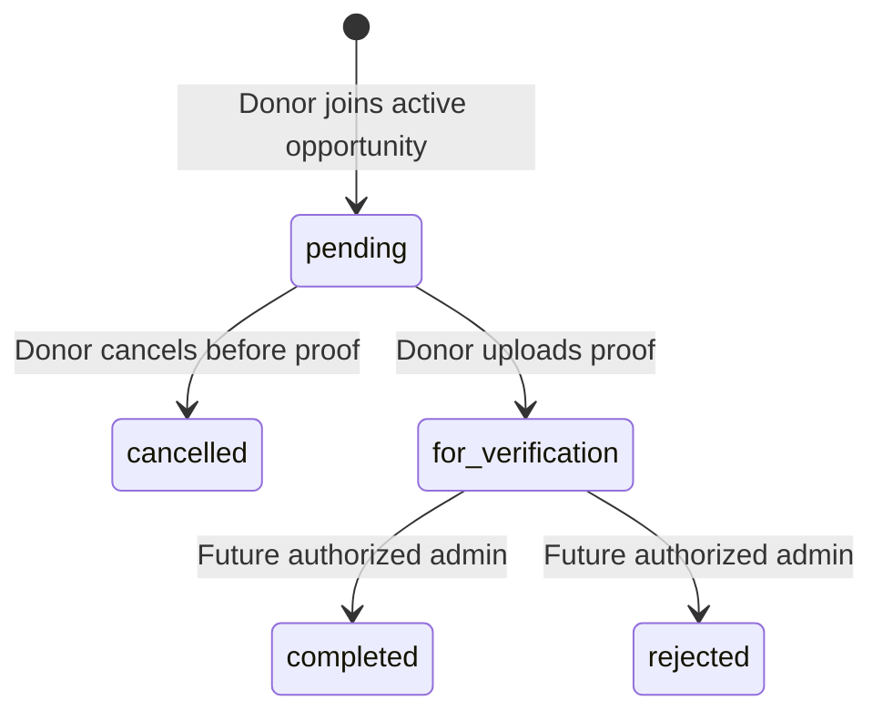

# Donation opportunity and participation architecture

> Proof storage update: the local/multipart proof flow described in this historical
> report has been replaced by [Firebase-ready JSON metadata](external-proof-metadata.md).
> Opportunities, participation states, cancellation, and summary rules remain current.

This supersedes the manual donor-entry flow in `donation-records-api.md`.
The existing records, completed-only summary, achievement service, account/profile,
and eligibility code were inspected and reused. No database was reset or recreated.

## Corrected mobile flow

Admin-posted opportunity → Announcement board → View Announcement → Evaluate or
Go Donate → confirmation → pending participation → Activity → proof → for_verification.

No admin publishing, authentication, verification, points awards, rewards, vouchers,
notifications, or AI routes are introduced. Evaluate opens the existing deterministic
Laravel eligibility flow. A join does not require or claim final medical clearance.

## Tables and relationships

Additive migration `2026_09_07_110000_create_donation_opportunities_and_participations`
ran successfully on `lifeflow_db` with ordinary `php artisan migrate`.

`donation_opportunities`: id, title, description, location, event_date, nullable
start_time/end_time, points_reward (unsigned, default zero), nullable published_at/
expires_at, status (draft/published/expired/cancelled), created_at, updated_at.
The active scope requires published status, published_at at or before now, and
expires_at strictly after now. Missing publication/expiry dates are not active.
Posts are never physically deleted by expiry.

`donation_participations`: id, user_id, donation_opportunity_id, status, joined_at,
nullable cancelled_at, proof_path, proof_original_name, proof_mime_type,
proof_uploaded_at, verified_at, rejection_reason, created_at, updated_at.
Statuses: pending, for_verification, completed, rejected, cancelled. Owner and
opportunity foreign keys are enforced. Opportunity deletion is restricted while
participation history exists; account deletion cascades to its activity rows.
Proof paths are hidden from JSON.

User hasMany DonationParticipation; participation belongsTo User and
DonationOpportunity. Opportunity hasMany participations. Existing User hasMany
DonationRecord remains. DonationRecord now belongsTo an optional participation.

`donation_records` remains the final trusted outcome/legacy history layer. It gains
a nullable, unique donation_participation_id foreign key. All old rows are retained;
old pending/rejected records remain non-counting legacy rows, without inventing
opportunities for them. Existing completed records continue to count.

## Mobile API

All routes require Sanctum `Authorization: Bearer <token>` and JSON Accept headers.

| Method | Endpoint | Behavior |
| --- | --- | --- |
| GET | `/api/donation-opportunities` | Active published opportunities, newest published_at then ID first |
| GET | `/api/donation-opportunities/{id}` | Active detail; inactive/draft/cancelled returns 404 |
| POST | `/api/donation-opportunities/{id}/join` | Empty body, 201 with participation and opportunity |
| GET | `/api/donation-participations` | Private history, 20/page, newest joined_at then ID first |
| GET | `/api/donation-participations/{id}` | Private detail including opportunity, even after expiry |
| POST | `/api/donation-participations/{id}/cancel` | Empty body; only pending can become cancelled |
| POST | `/api/donation-participations/{id}/proof` | Multipart `proof` file; only pending becomes for_verification |
| GET | `/api/donation-summary` | Existing completed-record total and achievement |

History supports `page` and `status=pending|for_verification|completed|rejected|cancelled`.
Read-only legacy `/api/donation-records` and `/api/donation-records/{id}` remain.
POST `/api/donation-records` is removed and returns 405. Its retained controller method
is also explicitly disabled (410 if ever called internally). The old validator and
historical one-time scripts remain unused for traceability; do not rerun old integration scripts.

Join locks the opportunity in a transaction before checking existing pending,
for_verification, or completed activity, preventing concurrent duplicate joins.
Duplicate joins return 409. Cancelled/rejected rows remain in history, and a new join
is allowed while the opportunity is active. Expired/draft/cancelled opportunities
cannot be newly joined. Expired opportunities remain readable via owned activity.

Cancel and proof lock the participation, so competing operations cannot both win.
Closed statuses return 409. Guests receive 401; cross-owner detail/cancel/proof
receives 404. Unknown donor fields—including user_id, completed/rejected status,
verified_at, or rewards—are rejected with 422. IDs in read query strings never
select another owner.

## Proof storage and picker

Proof accepts JPEG, PNG, or PDF, maximum 5 MB. Laravel checks file contents/MIME,
assigns a random filename on the private local disk (`storage/app/private/donation-proofs`),
and stores safe original-name/MIME/time metadata. It does not expose a public URL
or proof storage path. No public disk link is created. Failed writes remove only
the newly uploaded orphan file. Existing files are never replaced through donor APIs.

Frontend uses `expo-document-picker ~57.0.1`, matching the installed Expo SDK's
bundledNativeModules compatibility mapping. The Expo SDK was not upgraded.
The picker copies selected native files to cache before upload, following the
[Expo DocumentPicker API](https://docs.expo.dev/versions/latest/sdk/document-picker/).
The existing API helper now supports multipart without manually setting boundaries;
existing JSON and expired-token behavior are preserved.

Proof success returns for_verification and removes cancellation/upload controls.
It does not create a donation_record, grant points, or increment totals.

## Future trusted verification boundary

Future admin logic must authorize staff and, in one transaction, lock the
for_verification participation. For approval it must set completed/verified_at and
create exactly one completed donation_record linked through the unique participation
foreign key. Use the opportunity event_date/location and matching donor ownership.
For rejection set rejected, verified_at, and rejection_reason; create no counted record.
Repeated approval must be idempotent. No such admin route is exposed in this task.

Summary intentionally counts only donation_records.status=completed; simply changing
a participation to completed without finalizing its trusted record is not sufficient.
The existing achievement service automatically recalculates from that count:
0 New Donor; 1–2 First-Time Donor; 3–4 Bronze Donor; 5–9 Silver Donor; 10+ Gold Donor.
No streak field returns. Points are displayed as possible rewards after successful
verification; an actual points ledger/award operation remains a later feature.

## Frontend behavior

- Home's existing card styles now render the active API board. With an active admin
  post, newest admin is pinned, Red Cross is second, then other active posts. Without
  an active admin post Red Cross is pinned first. The fallback is a stable system
  card, never a joinable database opportunity; it remains visible on API errors.
- Home refreshes on focus and every 30 seconds while focused, and checks expiry each
  second. Expired cards leave the board without removing Activity history.
- New announcement details reuse the existing detail visual styles, with Back,
  Evaluate, and Go Donate. Confirmation includes title/date/location and possible
  points, explicitly awarded only after successful verification. Rapid duplicate
  requests are blocked, and backend duplicate checks remain authoritative.
- Activity reuses existing pagination/cards/filters but loads participation data
  and all five statuses. The manual date/location/notes form and submit button are gone.
- Activity details show opportunity data, potential points, pending proof/cancel
  actions, and verification/completed/rejected/cancelled messages. Proof and cancel
  use one synchronous busy lock. Profile's verified total/achievement cards remain.
- Existing auth/profile/eligibility behavior is preserved. No admin or AI feature was added.

## Files and verification

Created:

- `database/migrations/2026_09_07_110000_create_donation_opportunities_and_participations.php`
- `app/Models/DonationOpportunity.php`, `app/Models/DonationParticipation.php`
- `app/Http/Controllers/Api/DonationParticipationController.php`
- `tests/Feature/DonationParticipationTest.php`
- `tools/refactor-donation-architecture.cjs`, `tools/test-donation-architecture.cjs`
- `docs/donation-architecture.md`
- Frontend `src/app/announcement/[id].tsx`

Modified:

- Backend User/DonationRecord models, DonationRecordController, routes/api.php
- DonationRecordTest and the existing frontend contract test launcher
- Historical donation-record documentation (superseded notice)
- Frontend services/donations.ts, services/api.ts, contexts/auth-context.tsx
- Frontend Home, Activity, Activity Detail, root navigation
- Frontend package.json/package-lock.json for the compatible document picker

Backend regression suite: **118 tests passed, 856 assertions**. Covers active/inactive
opportunities, joins, duplicate blocking, expired activity visibility, cancellation,
private proof storage, file validation, terminal-state restrictions, cross-owner
denials, spoofed fields, retired manual API, completed-only counts and milestone tests,
plus all auth/profile/eligibility regressions.

Frontend TypeScript and source ESLint pass. Executable transport/ordering tests pass
for fallback ordering and expiry, five statuses, joins, multipart proof, errors, and
retired manual submission. Existing eligibility transport tests also pass.

## Manual Expo Go checks and remaining boundaries

1. With no active opportunity, confirm the Red Cross fallback is pinned and permanent.
2. With a legitimately published test opportunity, check pinned ordering and expiry.
   No fake production announcements were inserted by this task.
3. Open details, Evaluate, return, and Go Donate; verify confirmation and pending Activity.
4. Cancel pending activity; separately join and upload a JPEG/PNG/PDF under 5 MB.
5. Confirm for_verification, disabled cancel, unchanged totals, readable errors,
   and owned activity visibility after opportunity expiry.
6. Check the picker and card/button layout on a physical Expo Go device.

Physical Expo Go interaction was not run by command-line checks. Actual publishing
and verification wait for the future admin implementation. No unresolved product
decision blocks this mobile foundation; rejoin, expiry, private proof, and legacy-row
handling choices are documented above.
